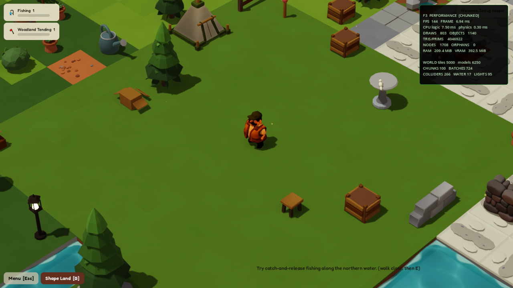

# Performance audit and large-world architecture

Audit date: 2026-07-29
Authoritative project: `C:\Dev\suma-nook`
Engine: Godot 4.6.3, Forward+, Vulkan
Benchmark GPU: NVIDIA RTX 3090 at 1280×720, VSync disabled

This audit applies to the current project and current imported keeper/wardrobe
pipeline. The obsolete prototype screenshot and its import descriptor were
removed. No player model, rig, animation, or current cowboy-vest asset was
replaced by the performance work.

## Outcome

Worlds at or above 512 tiles automatically use the chunked renderer. The exact
one-node-per-piece renderer remains active for small worlds, previews, and
existing behavior tests. Large worlds use:

- 8×8 independently culled spatial chunks;
- one `MultiMesh` per tile visual state and tile type in a chunk;
- material-grouped static prop geometry per chunk;
- one combined terrain, edge, and picking collision shape per applicable
  chunk, instead of colliders per tile/model;
- chunk-local continuous-water meshes and shoreline evaluation;
- at most four distance-faded warm lights per chunk;
- bounded, local CPU picking for batched structures;
- O(1) structure instance lookup and localized focus/click targeting.

This preserves the data-authoritative `WorldGrid`: scene nodes are a derived
presentation and can be rebuilt without changing save identity or gameplay
state.

## Measured comparison

The 900-land benchmark uses 900 grass tiles and 180 random registered models.
“Gameplay frame” uses the same close gameplay camera for both measurements.

| Metric | Before | After | Change |
|---|---:|---:|---:|
| Initial renderer build | 1110.27 ms | 494.90 ms | 55.4% lower |
| One tile edit | 43.69 ms | 10.22 ms | 76.6% lower |
| Gameplay frame | 2.436 ms | 0.787 ms | 67.7% lower |
| Scene nodes | 16,441 | 175 | 98.9% lower |
| Draw calls | 2,372 | 805 | 66.1% lower |
| Static bodies | 2,280 | 44 | 98.1% lower |
| Collision shapes | 5,165 | 44 | 99.1% lower |

The final all-catalog stress benchmarks use every one of the 32 loaded tile
definitions, every registered structure/model definition, deterministic biome
patches, and models distributed across random cells.

| World | Models | Build | One edit | Gameplay frame | Nodes | Chunks |
|---|---:|---:|---:|---:|---:|---:|
| 5,000 tiles | 1,250 | 1746.01 ms | 5.28 ms | 2.348 ms | 1,492 | 100 |
| 10,000 tiles | 2,500 | 3157.61 ms | 2.75 ms | 4.020 ms | 2,883 | 196 |

On the 5K world, the autosave snapshot occupied 11.17 ms on the main thread;
JSON formatting, verification, backup, and promotion completed in the
background in 84.45 ms total.

These figures demonstrate large scaling on the stated machine; they are not a
promise of literally zero latency on every GPU, resolution, or future asset
budget. The included profiler and repeatable benchmark are the ongoing
performance contract.

## Root causes found

1. Every tile and structure instantiated a complete scene hierarchy.
2. Every tile generated a trimesh picker plus separate gameplay collision.
3. Edge/water rebuilds operated globally after ordinary edits.
4. Water shoreline deformation compared every vertex with every shoreline
   segment.
5. Anchor timers and anchor visuals scanned the entire world every frame.
6. Proximity focus and click targeting allocated/sorted every cell slot.
7. Structure instance lookup scanned and sorted the complete world.
8. BFS queues used `pop_front()`, shifting the remaining array repeatedly.
9. Autosaves formatted, verified, and wrote large JSON payloads on the main
   thread.
10. Default 8× MSAA, 8192 directional shadows, ultra shadow filtering, and
    disabled mesh LOD spent GPU time with limited gameplay benefit.

## Fixes

- `WorldRenderer` selects the scalable backend at 512 tiles and rebuilds only
  the affected chunk/neighbour boundary after an edit.
- `TileVisualFactory`, `StructureVisualFactory`, and `AssetLibrary` flatten
  current authored/layered visuals once, group equal materials, and cache the
  result. No reference-game asset is used.
- Structure visuals are statically baked per chunk; their data instances remain
  individually pickable and stateful.
- Water generation uses local exposed-edge distance and eight subdivisions
  rather than a quadratic all-segment search at fourteen subdivisions.
- Resting anchors are indexed and tick at 5 Hz; only an actual regeneration
  emits a presentation refresh.
- Player focus is 3×3 local, click target discovery is bounded to 9×9 around
  the projected pointer, and scalable structure picking is 7×7 local.
- Structure IDs map directly to their slot/state. A fallback scan repairs a
  stale cache entry, while normal add/move/load paths maintain the index.
- BFS uses cursor indices and reverses the final route once.
- Autosave takes a data snapshot, then JSON formatting, verification, backup,
  and atomic promotion run on a worker thread. Manual Save remains synchronous
  and waits for an in-flight autosave before writing.
- `WorldGrid.to_save_dict()` no longer sorts all cells solely to serialize.
- The dock caches its structure location; unrelated tile changes no longer
  scan the entire world.
- The balanced default is 4× MSAA, 4096 directional shadows, high shadow
  filtering, and normal mesh LOD. The in-game High AA option remains available.

## F3 performance HUD

Press **F3** in a debug build. The top-right overlay reports:

- FPS, smoothed frame milliseconds, CPU logic and physics milliseconds;
- draw calls, rendered objects, triangles/primitives;
- node/orphan counts and static/video memory;
- renderer mode, world tile/model count, chunk/batch count;
- collision chunks, water chunks, and active batched warm lights.

The panel samples at 4 Hz to avoid becoming its own performance problem. It can
also start visible with `--perf-overlay`.

## 5K Debug World

From the running game: **Esc → Admin Controls → 5K Debug World**.

Or launch it directly:

```powershell
& "C:\Dev\Godot\Godot_v4.6.3-stable_win64.exe" `
  --path "C:\Dev\suma-nook" -- `
  --debug-world=5000 --perf-overlay
```

The generator uses seed `8675309`, includes all loaded tile definitions and all
registered model types, places 5,000 tiles plus 1,250 models, and keeps a safe
grass patch at the current keeper spawn. It switches persistence to
`user://suma_nook_debug_world.json` and pauses autosave, so the normal
`suma_nook_world.json` is never touched.

Current evidence capture:


## 10K Maxed Debug World

From the running game: **Esc → Admin Controls → 10K Maxed World**.

Or launch the exact max-density scenario directly:

```powershell
& "C:\Dev\Godot\Godot_v4.6.3-stable_win64.exe" `
  --path "C:\Dev\suma-nook" -- `
  --maxed-world --perf-overlay
```

This deterministic scenario places 10,000 tiles and 10,000 models: exactly one
registered model occupies every tile, including the keeper's spawn tile. It
cycles through every loaded tile definition and every registered model
definition. Like the 5K scenario, it uses the isolated debug save and pauses
autosave.

On the stated benchmark machine, the real main scene held 144 FPS / 6.95 ms in
the captured view. The final rendered benchmark measured 3.40 ms (approximately
294 FPS) at the gameplay camera and 9.59 ms (approximately 104 FPS) when forcing
the entire extreme world into view. Initial construction took 10.83 seconds;
that one-time static bake is deliberately the harshest possible case and is
separate from steady-state frame performance. The verifier reported 10,000
occupied tiles, 10,000 placed models, a maximum of one model on any tile, and
`one_model_on_every_tile: true`.

Current evidence capture:


## Repeatable commands

```powershell
# Core/data behavior
& "C:\Dev\Godot\Godot_v4.6.3-stable_win64_console.exe" `
  --headless --path "C:\Dev\suma-nook" --audio-driver Dummy `
  --script res://tests/test_runner.gd

# 900-tile land and water comparison
& "C:\Dev\Godot\Godot_v4.6.3-stable_win64_console.exe" `
  --path "C:\Dev\suma-nook" --disable-vsync --resolution 1280x720 `
  --audio-driver Dummy --script res://tests/performance_runner.gd -- `
  --sizes=900 --structures=0.2

# All-catalog stress world
& "C:\Dev\Godot\Godot_v4.6.3-stable_win64_console.exe" `
  --path "C:\Dev\suma-nook" --disable-vsync --resolution 1280x720 `
  --audio-driver Dummy --script res://tests/performance_runner.gd -- `
  --sizes=5000,10000 --structures=0.25 --mixed

# Max density: exactly one model on each of 10,000 tiles
& "C:\Dev\Godot\Godot_v4.6.3-stable_win64_console.exe" `
  --path "C:\Dev\suma-nook" --disable-vsync --resolution 1280x720 `
  --audio-driver Dummy --script res://tests/performance_runner.gd -- `
  --sizes=10000 --structures=1.0 --mixed
```

## Garden Galaxy clean-room findings used

The local audit reports were useful for architectural direction, not as code or
asset sources:

- `01_architecture_overview.md` supports data-centric persistent state,
  stable definition/instance IDs, event-driven presentation, and updating only
  simulations relevant to the active garden.
- `05_save_system.md` supports temp-file validation, backup rotation, and not
  saving transient placement reservations.
- `07_lighting.md` explicitly recommends validating a 4096 shadow map as the
  performance baseline instead of retaining 8192 unconditionally.
- `03_tile_and_placement_system.md` supports bounded/preallocated spatial
  queries and stable instance-owned state.

The audit did not contain a measured reference-game streaming/performance
implementation, and its controlled runtime sessions were explicitly
unperformed. No extracted meshes, textures, materials, shaders, code, or
private evidence were copied into this project.
